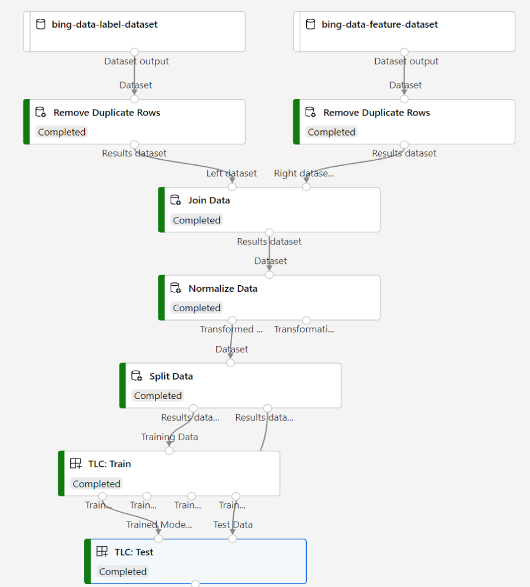

Bot detection training pipeline
=========================================
This is a sample to demonstrate bot detection training pipeline based on bing data in azure machine learning. In this pipeline, we use designer built-in modules for data preprocessing and migrated aether tlc modules for training.

Pipeline graph
-----------------------------

Dataset
-----------------------------
- small sample data is available in `data` folder.
- large data can be accessed via (file://STCAZR-A58/IsBotAsPos/large_data)

Results
-----------------------------
See logs in [this pipeline run](https://ml.azure.com/experiments/id/deb1692c-1c11-4573-92d1-240dd79800f5/runs/e64b98e7-87cd-419b-b9f8-b03bb73b7c8e?wsid=/subscriptions/e9b2ec51-5c94-4fa8-809a-dc1e695e4896/resourcegroups/thy-experiment/workspaces/heta-EUS&tid=72f988bf-86f1-41af-91ab-2d7cd011db47).
