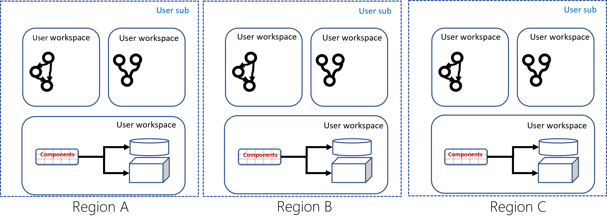
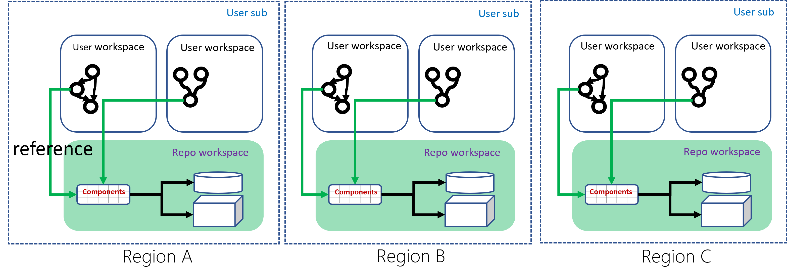

AzureML Asset Sharing
============================

This document is try to define tenant admin flow of feed management. For feed concept, refer to Manoj's deck: [AzureML Sharing](https://microsoft.sharepoint.com/:p:/t/Vienna/EffQQoagYQ5LtrJgGeKMn9QBee7utodw8ZOALu5Nyi1T0Q?e=m1abzH).

# Feed management

```yaml
name: OfficeML
description: Sharing ML assets in Office
tenant_id: XXX

asset_types:
    - component
    - dataset
    - model
    - environment

workspaces:
    - "/subscriptions/XXX/resourcegroups/XXX/workspaces/XXX_eastus"
    - "/subscriptions/XXX/resourcegroups/XXX/workspaces/XXX_eastus2"
    - "/subscriptions/XXX/resourcegroups/XXX/workspaces/XXX_westeurope"
```
The access control is defined through RBAC of workspace. And only tenant admin has the permission for feed operations.

* Create feed
```cmd
az ml feed create --file 'feed.yaml'
```

Create feed, means tag existing workspace with "repo" property, after the tagging, the assets within "repo workspace" could be available and used (by reference) from other workspace in the same tenant.

Due to asset use by reference is constrained within region, the best practice is to select one workspace per region as "repo workspace".

**workspace topology before feed creation:**




**workspace topology after feed creation:**


* Update feed

Update existing feed, could be used in two typical scenarios:
1. **New region setup.** Tenant admin need to setup workspace firstly (create all shared assets), then use feed update commant to tag that workspace as "repo workspace"
2. **Delete workspace with "repo workspace" tag.** The "repo workspace" cannot be deleted until the "repo workspace" tag is removed.
```cmd
az ml feed update --file 'feed.yaml'
```

* Delete feed

Delete feed equals to remove "repo workspace" tag, the workspaces been included in feed will change to normal user workspace after feed deletion.

```cmd
az ml feed delete --name 'OfficeML'
```

# Asset Publish Experience

There're discussion whether allow data scientist to publish assets from user workspace, which could be an appealing experience for 3P enterprise customer. Consider the quality control of shared asset, this actually need to be integrated with policy service, like approval process of the publish, and basic entry check (code review, code-sign, document, contactor ...)

For 1P team, they have the strong need that component/pipeline code should go through code review process, and for some shared DL algorithm, they even have the ask to manage source code in a centralized repository. Before the policy service intergration is complete, we encourage 1P team to use release pipeline to control the shared asset publish process.

* Grant permission to feed publish

Feed publish is a system behavior, tenant admin can leverage RBAC to grant "service principle" permission to create asset to "repo workspaces"

* Component publish

Use "component publish" to publish component to specific feed, the underline behavior is to multi-write component meta and snapshot to "repo workspaces" of this feed.

```cmd
# publish from local yaml:

az ml component publish --feed 'OfficeML' --file './path_of/component.yaml'

# publish from ADO Artifacts:

az ml component publish --package 'https://dev.azure.com/weda/recommenders/_apis/build/builds/51/artifacts?artifactName=snapshot&api-version=5.1&%24format=zip', --manifest './stratified_splitter.yaml' --feed 'OfficeML'
```

